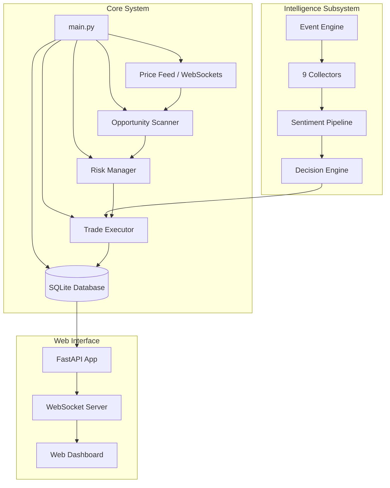

# 🚀 Advanced Crypto Arbitrage & Event Intelligence Bot

A high-frequency, multi-strategy cryptocurrency arbitrage and quantitative trading system. Built with Python, it leverages advanced statistical models, machine learning, and an independent real-time NLP sentiment analysis engine to exploit market inefficiencies across major centralized exchanges.

The system comes equipped with a modern FastAPI-powered dashboard presenting real-time analytics, coin watchlist statistics, order logs, and live event-based intelligence.

---

## 🌟 Key Features

### 1. Multi-Strategy Arbitrage Engine
*   **Cross-Exchange Arbitrage:** Real-time execution of order book spread anomalies between Binance, OKX, and other major platforms.
*   **Triangular Arbitrage:** High-speed detection of price discrepancies across multi-asset trading loops on a single exchange (e.g., USDT ➔ BTC ➔ ETH ➔ USDT).
*   **Funding Rate Arbitrage:** Spot-Futures convergence strategy capitalizing on high perp interest rate periods.
*   **Directional AI Momentum:** Machine learning-based breakout probability tracker monitoring volume and price expansion.
*   **Momentum Portfolio Rotation:** Systematic allocation of slots to top-ranked momentum coins.
*   **RSI Mean Reversion:** Statistical mean-reversion modeling using dynamic RSI bounds.

### 2. AI-Powered Event Intelligence Subsystem
An independent execution engine that gathers macro data, social buzz, and developer activity to trade immediate breaking news:
*   **9 Active Collectors:** Ingests live data from CoinGecko, Binance Announcements, Coinbase Blog, CoinMarketCap, RSS feeds, Google Trends, GitHub commits, Fear & Greed index, and Onchain Whale transactions.
*   **Sentiment Analysis Pipeline:** Processes incoming text via VADER Sentiment Analysis to compute real-time polarity scores.
*   **Automatic Decision Engine:** Translates raw sentiment scorecards directly into actionable entry/exit signals for directional trading when high-confidence news triggers.

### 3. Quantitative Risk & Money Management
*   **Fractional Kelly Criterion:** Dynamically scales trade position sizes based on historical win-loss probability and payoff ratios.
*   **Regime-Aware Position Scaling:** Multiplies allocation dynamically based on market regimes (Calm, Active, Chaotic) detected via Hidden Markov Models (HMM).
*   **Volatility Modeling:** Integrates GARCH volatility forecasting and Ornstein-Uhlenbeck (OU) spread half-life estimates.
*   **Hard-Coded Safe Gates:**
    *   Automatic **Kill Switch** on hitting daily loss limit.
    *   Temporary cooldown and pause on consecutive losses.
    *   Hard minimum exchange order protection limit ($10.00 USD safety floor).

### 4. Real-time Monitoring Web Dashboard
*   **High Performance Web Server:** Built on FastAPI, Uvicorn, and WebSockets.
*   **Live Charts & Analytics:** Renders equity curves, Win/Loss statistics, strategy breakdown charts, and current opportunity lists.
*   **Event Intelligence Log:** Visualizes real-time event scorecards and execution decision status as events flow in.

---

## 🛠️ Tech Stack

This project is built using a modern, asynchronous python stack optimized for low-latency quantitative analysis and trade execution:

*   **Core Language:** Python 3.10+ (Fully asynchronous utilizing `asyncio`)
*   **Exchange Connectivity:** [CCXT](https://github.com/ccxt/ccxt) (Unified library for multi-exchange REST and WebSocket connections)
*   **Web Framework & Real-Time:** 
    *   [FastAPI](https://fastapi.tiangolo.com/) (High-performance ASGI API framework)
    *   [Uvicorn](https://www.uvicorn.org/) (Fast ASGI web server)
    *   WebSockets (Bi-directional live data delivery to the UI)
*   **Frontend UI:** Vanilla HTML5, CSS3, Javascript (ES6), and [Jinja2](https://jinja.palletsprojects.com/) (Server-side rendering templates)
*   **Database:** SQLite database powered by [aiosqlite](https://github.com/omnilib/aiosqlite) (Asynchronous database client)
*   **Data Science & Technical Indicators:**
    *   [Pandas](https://pandas.pydata.org/) & [NumPy](https://numpy.org/) (Data manipulation and matrix mathematical tools)
    *   [pandas-ta](https://github.com/twopirllc/pandas-ta) (Technical indicator suite: RSI, Z-Score calculations)
*   **Quantitative Models & ML:**
    *   [hmmlearn](https://github.com/hmmlearn/hmmlearn) (Hidden Markov Models for market regime categorization)
    *   [arch](https://github.com/bashtage/arch) (GARCH model implementation for forecasting asset volatility)
    *   [statsmodels](https://www.statsmodels.org/) (Cointegration ADF test calculations)
    *   [SciPy](https://scipy.org/) (Ornstein-Uhlenbeck mathematical modeling)
    *   [scikit-learn](https://scikit-learn.org/) (Machine learning helper classes)
*   **NLP & Scrapers (Event Intelligence):**
    *   [vaderSentiment](https://github.com/cjhutto/vaderSentiment) (Rule-based sentiment analysis for news extraction)
    *   [BeautifulSoup4](https://www.crummy.com/software/BeautifulSoup/) & [lxml](https://lxml.de/) (Scraping and HTML parser engines)
    *   [feedparser](https://github.com/kurtmckee/feedparser) (RSS feed parser)
*   **Alerting & Utilities:**
    *   [python-telegram-bot](https://github.com/python-telegram-bot/python-telegram-bot) (Telegram notifications integration)
    *   `python-dotenv` (Local environment configuration configuration loader)
    *   `orjson` (Fast binary-optimized JSON parsing)

---

## 📐 System Architecture

The following diagram illustrates how the system modules interact:



---

## 📂 Project Structure

```
├── config/                 # Typed configurations and global constants
│   ├── settings.py         # Settings loader (.env parsing)
│   └── constants.py        # Exchange fee structures and trading parameters
├── core/                   # Trading logic and core executor
│   ├── strategies/         # Cointegration, momentum, triangular, and funding strategies
│   ├── executor.py         # Order placement wrapper (CCXT live execution & paper engine)
│   ├── price_feed.py       # WebSocket manager for order books and market ticker feeds
│   ├── scanner.py          # Opportunity detection ticker
│   └── risk_manager.py     # Kelly sizing, daily loss limit, and trading checks
├── dashboard/              # FastAPI dashboard server
│   ├── static/             # CSS, JS, and UI assets
│   ├── templates/          # Jinja2 HTML templates (dashboard UI)
│   └── app.py              # FastAPI app endpoints and WebSocket loops
├── data/                   # Persistence layer
│   ├── database.py         # SQLite connection manager and analytical helpers
│   └── models.py           # Database entity structures (Trade, Order, Opportunity)
├── discovery/              # Watchlist screener
│   ├── screener.py         # Scans exchanges for active tradable pairs
│   └── watchlist.py        # Manages top coins scored by the quant pipeline
├── event_intelligence/     # Real-time news & event-trading engine
│   ├── collectors/         # 9 independent feed ingestion scripts
│   ├── pipeline/           # Sentiment extraction and text cleaning
│   ├── decision/           # Confidence scorecard calculations
│   └── engine.py           # Ingestion manager thread
├── main.py                 # Core system entry point
└── requirements.txt        # Python dependency manifest
```

---

## 🛠️ Getting Started

### Prerequisites
*   Python 3.10 or higher
*   Windows, macOS, or Linux

### Installation

1.  **Clone the Repository:**
    ```bash
    git clone https://github.com/yourusername/crypto-arbitrage-bot.git
    cd crypto-arbitrage-bot
    ```

2.  **Create and Activate a Virtual Environment:**
    ```bash
    python -m venv .venv
    # Windows:
    .venv\Scripts\activate
    # macOS/Linux:
    source .venv/bin/activate
    ```

3.  **Install Dependencies:**
    ```bash
    pip install -r requirements.txt
    ```

4.  **Configure Environment Variables:**
    Copy the template env file:
    ```bash
    cp .env.example .env
    ```
    Open `.env` and fill in your details:
    *   `BINANCE_API_KEY` & `BINANCE_API_SECRET`
    *   `OKX_API_KEY` & `OKX_API_SECRET` (optional)
    *   `TRADING_MODE=paper` (set to `live` only when fully tested)
    *   `DASHBOARD_PORT=8081`

---

## 🚀 Running the Bot

To start the dashboard, websocket price feeds, scanning loops, and the AI Event Intelligence engine, execute the main entry point:

```bash
python main.py
```

Once running, navigate your web browser to:
👉 **[http://localhost:8081](http://localhost:8081)**

> [!NOTE]
> When started without API keys, the bot automatically falls back to **public (no-keys) mode** and defaults to **Paper Trading** on live data feeds.

---

## 🛡️ Risk Management Config

The default risk gates are highly conservative, optimized for a **$300** account capital:

*   **Max Allocation per Trade:** 5% (`MAX_POSITION_PCT = 0.05` / max $15 per order).
*   **Daily Drawdown Stop:** 3.0% daily loss limit (pauses trading to prevent wipeout).
*   **Consecutive Losses Gate:** Pauses trade scanner if the system registers 5 consecutive losses.
*   **Arbitrage Safety Floor:** Minimum size per order is set to **$10.00** to counter Binance base volume constraints and transaction fees.

To customize these limits, edit `.env` or adapt [settings.py](file:///c:/Users/mihir/.gemini/antigravity/scratch/crypto-arbitrage-bot/config/settings.py).

---

## 📝 License
This project is licensed under the MIT License - see the LICENSE file for details.

> [!WARNING]
> **Disclaimer:** Cryptocurrencies are highly volatile assets. Arbitrage strategies are susceptible to network lag, slippage, and sudden execution failures. Use the live trading features of this code at your own risk. Past performance does not guarantee future results.
